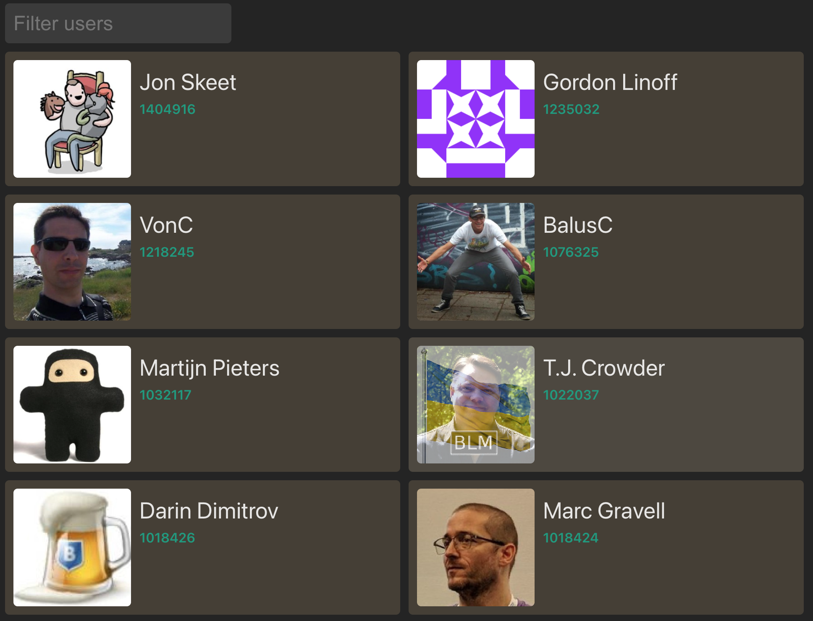

# Stackz

Stacks is React sample project that loads a list of the top 20 stack overflow users.

<p align="center">
    
</p>

## Built With

- Vite & SWC
- React
- Redux
- Typescript
- Vitest (Unit testing)
- SCSS (Using BEM naming conventions)
- Axios

## Features

- Loads and displays list of stack overflow users with profile name, reputation & image
- Responsive flex layout
- Toggle user follow
- Block user
- Search users

## Installation

1. Clone the repository: `https://github.com/autumn8/stackz.git`
2. Navigate to the project directory: `cd stackz`
3. Install dependencies: `npm install`

## Usage

1. Start the development server: `npm run dev`
2. Open your browser and visit `http://localhost:5173` to visit the app.

## Test

To test the project:

```bash
npm run test
```

## Build

To build the project for production:

```bash
npm run build
```

## Deploy
Auto deploys to firebase hosting on push to master though github actions. 
Deployment test url: https://stackz-a7f8e.web.app/

## TODO

- Extract conditional rendering logic for filtering into seperate components.
- Implement error logger.
- Add documentation generation
- Add cypress E2E tests
